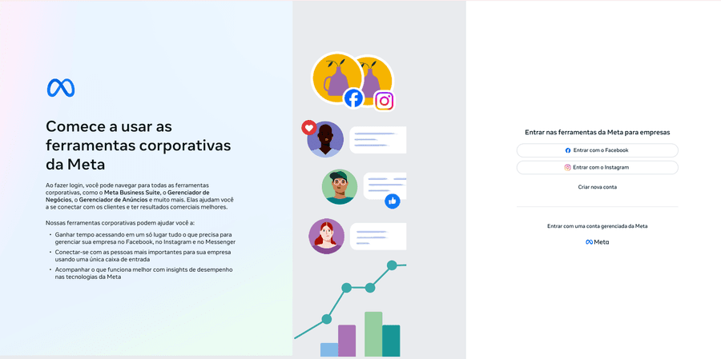

# Template — Manual de Tráfego Pago [CLIENTE]

> **Instruções de uso:** Substitua todos os `[MARCADORES]` por dados reais do cliente. Nunca entregue com marcador visível. Se o dado não existir ainda, escreva: `⚠️ Pendente: [o que precisa coletar]`.

---

# Manual de Tráfego Pago — [NOME DO CLIENTE]

**Projeto:** [Nome do Cliente]
**Data-base:** [DD/MM/AAAA]
**Semana da consultoria:** [Nº da semana]
**Plataformas ativas:** [Meta Ads / Google Ads / LinkedIn Ads / TikTok Ads]
**Objetivo:** Estruturar e operacionalizar a aquisição paga do cliente
**Status:** [Versão inicial / Revisado após semana X]

---

## 1. Para que serve este manual

Este manual existe para que qualquer pessoa — mesmo sem experiência prévia em mídia paga — consiga criar, lançar e otimizar as campanhas deste cliente sem depender de conhecimento tácito.

Deve ser consultado sempre que alguém for:

- Criar uma campanha nova em Meta Ads ou Google Ads
- Definir orçamento ou segmentação de público
- Escrever anúncios ou selecionar criativos para veicular
- Decidir se pausa, escala ou otimiza uma campanha
- Configurar rastreamento de conversão
- Explicar para o cliente por que a conta está estruturada de determinada forma

🔗 [Abrir planilha modelo (cópia)](https://docs.google.com/spreadsheets/d/1m22U6VI_MfVvlUi_4BzfcqQyf7HuS_5RiaCxA8-94tk/copy) — link "fazer uma cópia", exige login Google. Confirme o conteúdo antes de usar.

---

## 2. Resumo Executivo do Cliente

| Item | Dado |
|---|---|
| **Empresa** | [Nome] |
| **Segmento** | [Mercado e tipo de negócio] |
| **Localização / abrangência** | [Cidade, região, raio de atuação] |
| **Ticket médio** | [R$ X] |
| **Margem sobre o ticket** | [% ou R$ — usado para calcular CPA-alvo] |
| **Orçamento mensal de mídia** | [R$ X/mês] |
| **Meta de faturamento via tráfego pago** | [R$ X/mês] |
| **CPA-alvo (calculado)** | [R$ X — ticket × margem × margem de segurança] |
| **Ciclo de venda** | [Curto (mesmo dia) / Médio (dias) / Longo (semanas/meses)] |
| **Tipo de decisão** | [B2C impulso / B2C considerado / B2B comitê] |
| **Decisores no cliente** | [Nome(s) e cargo(s) — quem aprova campanha e orçamento] |

**Resumo estratégico em 3 linhas:**
[O que a empresa vende, por que tráfego pago é o canal certo agora e qual é a meta deste manual.]

---

## 3. Pré-requisitos Técnicos (bloqueantes)

> Nenhuma campanha deve ser lançada sem os itens desta seção resolvidos. Marcar pendências com destaque.

| Item | Status | Responsável | Observação |
|---|---|---|---|
| Business Manager / conta de anúncio Meta criada | [✅ / ⚠️ Pendente] | [Quem resolve] | [Detalhe] |
| Conta Google Ads criada e vinculada ao GA4 | [✅ / ⚠️ Pendente] | [Quem resolve] | [Detalhe] |
| Pixel Meta instalado no site | [✅ / ⚠️ Pendente] | [Quem resolve] | [Detalhe] |
| Conversions API (CAPI) configurada | [✅ / ⚠️ Pendente] | [Quem resolve] | [Detalhe] |
| Tag do Google Ads / GTM instalada | [✅ / ⚠️ Pendente] | [Quem resolve] | [Detalhe] |
| Evento de conversão definido e testado | [✅ / ⚠️ Pendente] | [Quem resolve] | [Detalhe] |
| Domínio verificado (Meta Business) | [✅ / ⚠️ Pendente] | [Quem resolve] | [Detalhe] |
| Landing page(s) publicada(s) | [✅ / ⚠️ Pendente] | [Quem resolve] | [Detalhe] |
| Catálogo de produtos (se e-commerce/Shopping) | [✅ / ⚠️ Pendente / N/A] | [Quem resolve] | [Detalhe] |

**Se houver qualquer item ⚠️ Pendente:** não avançar para lançamento de campanha até resolver. Ver `/tracking-web-and-capi` para setup de pixel/CAPI/GTM.

---

## 4. Estrutura de Conta

> Na versão HTML, cada "Guia passo a passo" abaixo é um menu sanfona (accordion) — clique no título para abrir/fechar. Alguns guias trazem também uma ilustração genérica da tela (sem dado de conta real). Uma barra fixa no topo da página ("Meta Ads" / "Google Ads") deixa o leitor alternar qual bloco de plataforma aparece em cada seção com um clique — conteúdo compartilhado entre as duas plataformas continua sempre visível. Os títulos de explicação/tabela abaixo (ex: "Padrão de nomenclatura", "CBO vs. ABO") também viram menu sanfona na versão HTML, com visual neutro para diferenciar de um guia passo a passo — separa melhor o conteúdo sem deixar a seção comprida demais.

### 🔵 META ADS — início do bloco

```
Conta de Anúncios
└── Campanha [Objetivo: Tráfego / Leads / Vendas / Mensagens]
    └── Conjunto de Anúncios [Público + orçamento + posicionamento]
        └── Anúncio [Criativo + texto + CTA]
```

**Modelo de otimização de orçamento:** [CBO (Campaign Budget Optimization) / ABO (Ad Set Budget Optimization)]
**Por quê:** [Justificativa — nº de públicos a testar, maturidade da conta, fase de teste ou escala]

> **🧭 Guia passo a passo — Criar a conta do zero**
>
> 🔗 [Ver tutorial original](https://app.tango.us/app/workflow/01-00-Criando-e-configurando-sua-conta-de-an-ncios-no-Meta-do-Zero-7c4dd9989e84429589cf3d6ae2e917d4) *(tutorial de terceiro — pode conter tela de conta/negócio não relacionado a este projeto)*
>
> 
> *Tela de acesso às ferramentas corporativas da Meta — é a primeira tela que aparece ao iniciar o passo 1*
>
> 1. Criar/logar conta pessoal Meta (Facebook/Instagram)
> 2. Criar o Business Manager (BM) vinculado à conta pessoal
> 3. No BM: Configurações → Contas → Contas de anúncios → Adicionar → Criar nova conta de anúncios
> 4. Nomear a conta e definir fuso horário e moeda — **não é possível alterar depois**
> 5. Cadastrar forma de pagamento (cartão de crédito recomendado)
> 6. Criar a Página do Facebook da empresa (se ainda não existir)
> 7. Vincular a conta do Instagram à BM
> 8. Vincular o WhatsApp Business à BM

> **🧭 Guia passo a passo — Configurar o Pixel**
> 🔗 [Ver tutorial original](https://app.tango.us/app/workflow/Configura--o-do-pixel-do-Meta-Ads-19c4251c538549c58833591e2551ec26) *(tutorial de terceiro — pode conter tela de conta/negócio não relacionado a este projeto)*
> Pré-requisito da seção 5 (Rastreamento).
> 1. No BM: Fontes de Dados → Conjuntos de dados → Adicionar → escolher a conta de anúncios
> 2. Nomear o pixel e criar
> 3. Atribuir pessoas/permissões de acesso
> 4. Conectar o pixel à conta de anúncios em "Outros ativos de negócios"
> 5. No Gerenciador de Eventos: ativar "Correspondência Automática de Site" e "Rastrear eventos automaticamente sem código"
> 6. Gerar o código do pixel e inserir na `<head>` do site — ou via Google Tag Manager

**3 tipos de evento do pixel:** evento padrão (manual no código), evento personalizado (nomeado por você no código), conversão personalizada (criada a partir de uma URL, sem código).

### Padrão de nomenclatura

| Nível | Formato | Exemplo |
|---|---|---|
| Campanha | `[OBJETIVO] [PÚBLICO F/M/Q] [POSICIONAMENTO] [TAG] Descrição` | `[CONVERSÃO] [F] [STORIES] [DESAFIO] Vídeo convite` |
| Conjunto de anúncios | `(Nº) - [AUTO/MANUAL] - [Nome do público]` | `01 - [FEED] Envolvimento IG 14D` |
| Anúncio | `AD(nº) - Descrição identificável` | `AD01 - Convite de cabeça para baixo` |

F = Frio, M = Morno, Q = Quente. Campanha com 5 conjuntos × 6 anúncios cada = campanha "1-5-6".

### CBO vs. ABO

| | CBO (nível de campanha) | ABO (nível de conjunto) |
|---|---|---|
| Quem decide o gasto por público | A Meta decide, pode zerar um público | Você decide, valor fixo |
| Controle | Menor | Maior |
| Trabalho de otimização | Menor | Maior |
| Quando usar | Padrão — melhor resultado na maioria dos casos | Comparar públicos em igualdade de condições |

**Orçamento Diário** (padrão) vs. **Orçamento Total/vitalício** (só para negócio físico com horário restrito).

**Campanhas Advantage:** 4 recursos independentes — Campanha Advantage (todos ativados), Orçamento Advantage (=CBO), Público Advantage (segmentação automática), Posicionamento Advantage. Testar com Advantage ativado primeiro; desativar recurso a recurso só onde os dados mostrarem necessidade. Advantage não é a estratégia — faz parte dela.

### Posicionamentos — onde o anúncio aparece

Guia passo a passo — escolher o posicionamento (etapa "Posicionamentos" na criação do conjunto de anúncios):
1. Deixar marcado "Posicionamentos Advantage+" (automático) como padrão — entrega mais resultado do que a escolha manual na maioria dos casos
2. Só trocar para "Posicionamentos manuais" se: um posicionamento específico já provou não gerar resultado, você quer isolar orçamento para testar um posicionamento sozinho, ou vai criar arte específica para um formato (ex: só Stories)
3. No manual, escolher a plataforma (Facebook/Instagram/Messenger/Audience Network) e depois o posicionamento dentro dela (feed, stories, reels, in-stream)
4. Em "Mostrar mais opções" é possível filtrar por tipo de sistema operacional e por conexão Wi-Fi — recursos pouco usados, mas disponíveis
5. Fornecer criativo nos formatos vertical (Stories/Reels) e quadrado/horizontal (Feed) sempre que possível — libera mais opções de formato e faz o automático performar melhor

*(fim do bloco Meta Ads)*

### 🟡 GOOGLE ADS — início do bloco

```
Conta
└── Campanha [Rede de Pesquisa / Performance Max / Display / Remarketing]
    └── Grupo de Anúncios [1 tema/dor por grupo]
        └── Anúncios (RSA) + Palavras-chave
```

**Estrutura de campanhas por:** [Dor/oferta — ver seção 9] ou [Categoria de produto, se e-commerce]

> **🧭 Guia passo a passo — Criar a conta do zero** (com prints reais do fluxo do Google Ads)
> 🖼️ *7 screenshots reais na versão HTML: empresa/destino do clique, vincular contas, sequência de etapas, confirmar país/fuso/moeda, conta criada, verificação do anunciante (2 telas).*
> 1. Pesquisar "Google Ads" no Google e abrir o link oficial (ou `ads.google.com` direto)
> 2. Clicar em "Começar agora" e logar com uma Conta do Google
> 3. Informar o nome da empresa e o destino do clique
> 4. Vincular o Perfil da Empresa no Google, se já existir
> 5. Escolher "Criar sua campanha" (fluxo guiado) ou "Configurar apenas a conta"
> 6. Confirmar país de faturamento, fuso horário e moeda — não dá para alterar depois
> 7. Cadastrar forma de pagamento e enviar — a conta é criada na hora
> 8. Concluir a "Verificação do anunciante" — obrigatória para veicular anúncios; responder se a organização é agência ou marca própria

> **🧭 Guia passo a passo — Conceder acesso a alguém** (Adm. › Acesso e segurança — equivalente a "Membros da Business Manager")
> 🖼️ *4 screenshots reais na versão HTML: tela de configurações da conta, convite com níveis de acesso, comparação detalhada, verificação em duas etapas.*
> 1. Menu "Adm." → "Acesso e segurança" → aba "Usuários" → "Adicionar"
> 2. Digitar o e-mail da pessoa (precisa ter Conta do Google)
> 3. Escolher o nível: Somente e-mail, Faturamento, Somente leitura, Padrão ou Adm.
> 4. Enviar convite — a pessoa recebe e-mail e confirma

**Conexões que valem a pena fazer:** YouTube (canal próprio, mesmo sem publicar — usado para subir vídeo de anúncio, pode ser "não listado"), Google Analytics, Google Merchant Center (obrigatório e-commerce), Google Meu Negócio (essencial para negócio físico).

*(fim do bloco Google Ads)*

---

## 5. Rastreamento e Mensuração

> Pré-requisito da seção 3. Aqui documenta-se o que já está configurado e como validar.

| Evento | Onde dispara | Plataforma que recebe | Como validar |
|---|---|---|---|
| [PageView] | [Toda página] | [Meta Pixel + GA4] | [Meta Pixel Helper / GTM Preview] |
| [Lead/Contato] | [Envio de formulário] | [Meta CAPI + Google Ads] | [Eventos de teste] |
| [Contato via WhatsApp] | [Clique no botão] | [Meta Pixel + GTM] | [Eventos de teste] |
| [Compra, se e-commerce] | [Página de obrigado] | [Meta CAPI + Google Ads + GA4] | [Valor e moeda batendo com o pedido real] |

**Padrão de UTM:**
```
utm_source=[meta/google]&utm_medium=cpc&utm_campaign=[nome-campanha]&utm_content=[nome-anuncio]
```

**Janela de atribuição usada:** [1 dia clique / 7 dias clique / 1 dia visualização]

### Tag do Google Ads (equivalente ao Pixel)

A tag do Google Ads é o "pixel" do Google. Duas peças:

| | Tag do Google Ads | Ação de conversão |
|---|---|---|
| Quantas por conta | Uma só | Uma por evento a medir |
| Onde instalar | Todas as páginas do site | Só na página do evento (ex: "obrigado") |
| Equivale a | O pixel/base do Meta | Um evento do Meta (Lead, Comprar) |

**3 formas de instalar:** Google Tag Manager (recomendado), manual (colar snippet no `<head>`/`<body>`) ou enviar por e-mail para quem cuida do site. No código: tag = `AW-XXXXXXXXXX`, ação de conversão = `AW-XXXXXXXXXX/YYYYYYYYYYY`.

**Por que importa:** informa ao Google Ads o que vende e o que não vende, treina o algoritmo de lances automáticos, e permite criar públicos personalizados a partir do comportamento real no site (ver seção 7).

---

## 6. Orçamento por Fase

| Fase | Duração | Orçamento/dia | Objetivo da fase | Critério de avanço |
|---|---|---|---|---|
| **Teste** | [X dias/semanas] | [R$ X/dia] | Validar públicos, criativos e mensagens | [Nº mínimo de conversões ou dados para decidir] |
| **Otimização** | [X dias/semanas] | [R$ X/dia] | Concentrar verba no que performou na fase de teste | [CPA dentro da meta em X dias consecutivos] |
| **Escala** | [Contínuo] | [R$ X/dia, com incrementos de Y%] | Crescer volume mantendo CPA-alvo | [CPA estável ao aumentar orçamento em incrementos de 15–20%] |

**Regra de ouro do orçamento:**
> Nunca aumentar orçamento de uma campanha em mais de 20% de uma vez — isso reinicia o aprendizado do algoritmo e distorce o CPA por alguns dias.

---

## 7. Segmentação e Públicos

> Baseado no ICP e nas personas do Manual de Copy — ver [link/seção do Manual de Copy]. Na versão HTML, os títulos de explicação/tabela abaixo (ex: "Como escolher o público-alvo", "Palavras-chave negativas globais") viram menu sanfona, com visual neutro para diferenciar dos guias passo a passo.

### 🔵 META ADS — início do bloco

### Públicos Meta Ads

| Tipo | Definição | Objetivo no funil |
|---|---|---|
| **Frio (interesse)** | [Interesses, comportamentos, dados demográficos do ICP] | Topo — geração de demanda |
| **Frio (lookalike)** | [Lookalike 1–3% de: base de clientes / eventos de conversão] | Topo — escala de aquisição |
| **Morno (engajamento)** | [Quem interagiu com perfil/posts/vídeo nos últimos X dias] | Meio — aquecimento |
| **Quente (remarketing)** | [Quem visitou site/LP sem converter nos últimos X dias] | Fundo — conversão |
| **Quente (base própria)** | [Lista de clientes/leads para upsell ou reativação] | Fundo/Retenção |

### Como escolher o público-alvo (Meta Ads)

- **Automáticos** — com ou sem sugestão (a Meta escolhe livre ou direcionada)
- **Personalizados** — pessoas que já tiveram contato com você/seus anúncios/conteúdos
- **Semelhantes** — parecidos com o público personalizado (escolha o mais qualificado como base)
- **Demográficos** — localização, idade, gênero, idioma
- **Direcionamento detalhado** — interesses/comportamentos específicos

### A lógica do "E" e do "OU"

Combinar critérios com **E** (limitador) restringe à interseção; com **OU** (adicionador) soma os grupos.

Exemplo — público que "empreende" e/ou "tem interesse em gatos":
- `empreende E gatos` → só quem tem as duas características → público mais estreito e qualificado
- `empreende OU gatos` → quem tem qualquer uma → público mais amplo

### Formas de segmentar além de idade/interesse

- Controle de público-alvo — limita para quem a Meta pode anunciar (nível de conjunto ou de conta)
- Através do pixel/conjunto de dados — a base de eventos do site vira público (pixel precisa estar "aquecido": anunciando de forma constante, com eventos corretos)
- Interações passadas com os anúncios — a Meta expande para pessoas parecidas com quem já interagiu
- Através do anúncio — o texto/imagem é o filtro mais forte de todos

> **Regra:** o anúncio deve ser filtro, não ímã — não é para atrair todo mundo, é para atrair só quem converte. Use todas as formas de segmentação ao mesmo tempo, nenhuma substitui a outra.

*(fim do bloco Meta Ads)*

### 🟡 GOOGLE ADS — início do bloco

### Como segmentar público no Google Ads

| Tipo | Foco | Controle | Quando usar |
|---|---|---|---|
| Público-alvo | A pessoa | Alto | Quando você já conhece bem o ICP |
| Conteúdo | Onde o anúncio aparece | Médio | Quando conhece os canais/sites certos |
| Segmentação otimizada | O Google escolhe por você | Baixo | Testes — evite como padrão |
| Indicadores de público-alvo | Você sugere, o Google decide | Baixo | Campanhas Performance Max |

> **🧭 Guia passo a passo — Criar um público-alvo** (Ferramentas › Biblioteca compartilhada › Gerenciador de públicos-alvo)
> 🖼️ *3 screenshots reais na versão HTML: tela "Novo público-alvo", "Novo segmento personalizado" e informações demográficas.*
> Dentro de "Público-alvo" há 4 subtipos combináveis:
> 1. **Meus dados (remarketing):** quem visitou o site, usou o app, interagiu com o YouTube ou está numa lista de clientes
> 2. **Segmentos personalizados:** você ensina o público ideal por intenção de compra, termos pesquisados, sites que a pessoa acessa (inclusive concorrentes), canais do YouTube ou apps no celular
> 3. **Públicos prontos:** "No mercado" (intenção ativa), eventos importantes, demografia detalhada, afinidade
> 4. **Demografia clássica:** idade, gênero, localização, renda familiar estimada

> **🧭 Guia passo a passo — Trazer público do Google Analytics (GA4)**
> 🖼️ *3 screenshots reais na versão HTML: selecionar propriedade GA4, templates prontos (Compradores, Usuários inativos etc.), condições do público "Compradores".*
> 1. Escolher um template pronto ou criar personalizado
> 2. Ajustar condições (eventos como `purchase`, `in_app_purchase`, `ecommerce_purchase`)
> 3. Definir duração da adesão (padrão 30 dias)
> 4. Salvar — leva algumas horas para popular

### Como escolher as palavras-chave (Google Ads)

No Google Ads não existe "público" da mesma forma que no Meta — a segmentação primária é por intenção de busca, expressa em palavras-chave. Agrupe por camada de intenção, uma dor/tema por grupo de anúncios (mesma regra da seção 4):

| Camada | Palavras-chave | Tipo de correspondência | Intenção |
|---|---|---|---|
| [Dor 1] | [termo 1], [termo 2] | [Frase / Exata] | [Alta — pronto para comprar] |
| [Dor 2] | [termo 1], [termo 2] | [Frase / Exata] | [Média — pesquisando solução] |

**Tipos de correspondência:** ampla (mais volume, menos controle — usar com cautela e lances automáticos), frase (equilíbrio, a expressão precisa aparecer na busca) e exata (mais controle, menor volume, maior intenção). Comece por frase/exata e só teste ampla depois de ter dados de conversão.

**Palavras-chave negativas globais (todas as campanhas):**
`[concurso], [grátis], [curso], [como fazer eu mesmo], [emprego/vaga], [outras negativas específicas do segmento]`

Aplicar em todas as campanhas de Pesquisa — evita gastar verba com buscas sem intenção de compra. Revisar semanalmente o relatório de "Termos de pesquisa" para achar novas negativas.

*(fim do bloco Google Ads)*

---

## 8. Fórmula de Alocação de Verba

> Distribuição inicial de orçamento entre plataformas e campanhas, revisada a cada ciclo de otimização.

| Plataforma/Campanha | % do orçamento | Justificativa |
|---|---|---|
| [Google Ads — Rede de Pesquisa] | [X%] | [Captura de demanda ativa — maior intenção de compra] |
| [Meta Ads — Prospecção] | [X%] | [Geração de demanda — alcance do ICP antes da pesquisa] |
| [Meta Ads — Remarketing] | [X%] | [Menor volume, maior conversão — recuperar quem não converteu] |
| [LinkedIn Ads, se B2B] | [X%] | [Prospecção por cargo/setor — ativar após fase 2] |

---

## 9. Arquitetura de Campanhas

> Na versão HTML, o "Cardápio de campanhas" abaixo vira um menu sanfona — cada tipo de campanha começa fechado e abre ao clicar, o que deixa a leitura mais rápida com os 8 tipos. Os títulos de explicação/tabela (ex: "Como escolher o objetivo certo", "Estratégia de lance") também viram menu sanfona, com visual neutro para diferenciar dos guias passo a passo.

### 🔵 META ADS — início do bloco

### Como escolher o objetivo certo

| Objetivo | Para que serve | Metas de otimização dentro dele |
|---|---|---|
| Reconhecimento | "Martelar" ideia, público pequeno | Alcance (pessoas únicas) · Impressão (frequência) · Incrementalidade |
| Tráfego | Enviar volume para destino específico | Clique no link (foco em clique) · Visualizações de página (foco no carregamento) |
| Engajamento | Interação com posts/vídeos/mensagens | Visualização de vídeo · Aplicativos de mensagens · Interação com a publicação |
| Cadastro | Coletar dados de contato | Cadastro no site (mais comprometimento) · Formulário instantâneo (mais volume) |
| Venda | Vender | Site (requer pixel+API de conversões) · Catálogo (dinâmico, e-commerce) |
| Botão turbinar | Crescer o perfil | Visitas ao perfil · Seguidores |

**Cadastro no site vs. Formulário instantâneo:** no site, mais comprometimento (a pessoa sai do fluxo automático para preencher); no formulário instantâneo, preenchimento automático e mais volume, às vezes com leads menos qualificados. Vale testar os dois.

### Cardápio de campanhas do Meta Ads — passo a passo de cada tipo

**Campanha de Seguidores** (Engajamento · só funciona com posicionamento Instagram)
> 🔗 [Ver tutorial original](https://app.tango.us/app/workflow/Campanha-de-Seguidores-ba015e15949342c3937bfe39112b2787) *(tutorial de terceiro — pode conter tela de conta/negócio não relacionado a este projeto)*
> 🖼️ *Ilustração genérica na versão HTML: botões de meta de otimização com "Seguidores" selecionado + toggle "posicionamento só Instagram" ligado.*
1. Criar campanha com objetivo Engajamento → meta de otimização "Seguidores"
2. Criar o público: semelhante (lookalike de quem já segue/engaja) ou por interesse relacionado ao nicho
3. Na aba de exclusões, excluir quem já segue o perfil
4. Em Posicionamentos, trocar para manual e deixar só Instagram (remover Facebook e Audience Network)
5. Escolher uma publicação já no ar no Instagram — post feito só no Facebook não funciona
6. Aplicar o público ao conjunto de anúncios e revisar orçamento
7. Publicar e acompanhar custo por seguidor

**Campanha de Mensagens (WhatsApp / Direct / Messenger)** (Engajamento · clique vai direto para conversa)
> 🔗 [Ver tutorial original](https://app.tango.us/app/workflow/43bb362f-d95b-4385-94f4-a782779e4487) *(tutorial de terceiro — pode conter tela de conta/negócio não relacionado a este projeto)*
> 🖼️ *Ilustração genérica na versão HTML: seletor de app (WhatsApp selecionado) + toggle de modelo de mensagem.*
1. Criar campanha com objetivo Engajamento → meta "Aplicativos de mensagens"
2. Escolher o app de destino: WhatsApp, Messenger ou Instagram Direct
3. Selecionar o modelo de mensagem: "Iniciar conversas" (simples, mais volume) ou "Formulário no WhatsApp" (qualifica antes de atender)
4. Se formulário: montar as perguntas de qualificação dentro do anúncio
5. Definir segmentação (local, idade, lookalike/personalizado)
6. Subir criativo com CTA "Enviar mensagem" e testar o botão antes de publicar
7. Publicar e monitorar tempo de primeira resposta da equipe

**Catálogo para E-commerce** (Vendas · requer catálogo sincronizado na Business Manager)
> 🔗 [Ver tutorial original](https://app.tango.us/app/workflow/d04081cb-0c5a-420d-9c35-8e6c7cf399bf) *(tutorial de terceiro — pode conter tela de conta/negócio não relacionado a este projeto)*
> 🖼️ *Ilustração genérica na versão HTML: campos de catálogo/conjunto de produtos + seletor de formato (Carrossel selecionado).*
1. Confirmar catálogo ativo em Comércio → Catálogos
2. Criar campanha com objetivo Vendas → "Usar catálogo" (Catálogo Advantage+)
3. Escolher a fonte do catálogo e o conjunto de produtos
4. Definir evento de conversão "Site", otimizando para compra
5. Escolher formato Carrossel (recomendado)
6. Conferir que o destino do clique é a página exata do produto — nunca home/coleção genérica
7. Publicar

**Vendas no site** (Vendas · evento "Comprar" · requer pixel validado)
> 🔗 [Ver tutorial original](https://app.tango.us/app/workflow/Criando-e-configurando-suas-campanhas-de-vendas-no-site-464e9720bc3848429082f953c3d08b82) *(tutorial de terceiro — pode conter tela de conta/negócio não relacionado a este projeto)*
> 🖼️ *Ilustração genérica na versão HTML: seletor de evento de conversão com "Comprar" selecionado.*
1. Criar campanha com objetivo Vendas → conversão "Site"
2. Selecionar evento de otimização "Comprar" (nunca "Cliques no link")
3. Definir segmentação: local, idade, gênero, personalizados/lookalike de compradores
4. Escolher CBO ou ABO
5. Subir criativo com URL final apontando direto para produto/carrinho
6. Escrever texto e CTA de ação
7. Confirmar no Gerenciador de Eventos que "Comprar" dispara corretamente antes de publicar

**Leads — Landing Page** (Cadastro · usa o pixel/evento da seção 5)
> 🔗 [Ver tutorial original](https://app.tango.us/app/workflow/Campanha-de-Leads---Landing-Page-01135f2e599c41a5a728c1009ed86f3b) *(tutorial de terceiro — pode conter tela de conta/negócio não relacionado a este projeto)*
> 🖼️ *Ilustração genérica na versão HTML: seletor de local de conversão ("Site" selecionado) + campo de URL da LP.*
1. Criar campanha com objetivo Cadastro → "no site" (não Formulário instantâneo)
2. Confirmar pixel e evento de conversão (ex: Lead) testados na LP
3. Definir segmentação de público conforme o ICP
4. Subir criativo com a URL da LP (nunca a home institucional)
5. Escrever headline e CTA reforçando a oferta da LP
6. Publicar
> Repetir os mesmos passos trocando o objetivo para "Tráfego" gera uma campanha irmã de topo de funil para a mesma LP.

**Leads — Formulário nativo** (Cadastro · não depende de LP própria)
> 🔗 [Ver tutorial original](https://app.tango.us/app/workflow/Campanha-de-Leads---Formul-rio-nativo-c02b83d5f1254112909a0bd40f5dbcf7) *(tutorial de terceiro — pode conter tela de conta/negócio não relacionado a este projeto)*
> 🖼️ *Ilustração genérica na versão HTML: checklist da estrutura do formulário (boas-vindas, perguntas, política, agradecimento).*
1. Criar campanha com objetivo Cadastro → "Formulários instantâneos"
2. Montar o formulário no próprio Meta: boas-vindas, perguntas, agradecimento
3. Definir segmentação de público
4. Subir criativo com CTA "Cadastre-se"
5. Conectar o formulário a planilha/CRM (integração ou download manual) — sem isso o lead se perde
6. Publicar

**Distribuição de conteúdo** (Engajamento · alcance/views de vídeo ou interação)
> 🔗 [Ver tutorial original](https://app.tango.us/app/workflow/Campanha-de-distribui--o-de-conte-do-46b21a3f703c4237b4c6367d5d0582b6) *(tutorial de terceiro — pode conter tela de conta/negócio não relacionado a este projeto)*
> 🖼️ *Ilustração genérica na versão HTML: meta de otimização ("Visualizações de vídeo" selecionado) + toggle Audience Network desligado.*
1. Criar campanha com objetivo Engajamento → "Visualizações de vídeo" ou "Interação com a publicação"
2. Em Posicionamentos manuais, desativar Audience Network (visualizações não qualificadas)
3. Definir segmentação
4. Subir criativo (vídeo/carrossel) já publicado
5. Publicar e acompanhar retenção/ThruPlay, não só custo por visualização

**Estratégia WAR (território)** (dominação geográfica local)
> 🔗 [Ver tutorial original](https://app.tango.us/app/workflow/Estrat-gia-WAR-f3b7b2a46583476dbe1da38089d0e2fa) *(tutorial de terceiro — pode conter tela de conta/negócio não relacionado a este projeto)*
> 🖼️ *Ilustração genérica na versão HTML: campos de local (pino manual + raio de 2km).*
1. Criar campanha com objetivo Engajamento ou Cadastro/Mensagens, conforme a oferta
2. Na segmentação de local, fixar o pino manualmente no endereço exato — nunca bairro/CEP inteiro
3. Definir raio inicial de 2km
4. Completar com idade e interesses do público local
5. Subir criativo com oferta local clara
6. Publicar e acompanhar Frequência diariamente
7. Se a frequência subir muito, aumentar o raio aos poucos — nunca de uma vez

### Estratégia de lance

Lance e orçamento são acelerador e freio — andam sempre juntos (aumentar orçamento aumenta o lance automaticamente).

| Estratégia | Como funciona | Quando usar |
|---|---|---|
| Valor / Volume mais alto (padrão) | 100% automático — máximo resultado dentro do orçamento | Praticamente sempre |
| Limite de lance | Teto manual — não controla o custo por ação final | Casos específicos de controle de leilão |
| Meta de custo por resultado | Mantém custo perto de um valor-alvo, com flutuação | Quando já existe CPA-alvo validado |
| Meta de ROAS | Define retorno mínimo sobre investimento | E-commerce, Vendas/Catálogo |

Lance alto = paga mais caro por resultado, mas aparece mais. Pagar mais caro não é necessariamente ruim — o objetivo é achar quem no mercado vale a pena pagar mais caro para converter.

*(fim do bloco Meta Ads)*

### 🟡 GOOGLE ADS — início do bloco

### Cardápio de campanhas do Google Ads — passo a passo de cada tipo

No Google Ads a arquitetura muda: em vez de "objetivo → conjunto de anúncios → anúncio" (Meta), a lógica é **rede/tipo de campanha → grupo de anúncios (1 por dor/tema) → anúncio + palavras-chave** (ver diagrama da seção 4).

### As redes do Google Ads

| Rede | O que é | Melhor para |
|---|---|---|
| Pesquisa (Search) | O Google clássico — aparece no topo da busca | Captura de demanda ativa; todo anunciante deve estar aqui pelo menos com o nome da marca |
| Display (GDN) | Banners em sites parceiros | Remarketing |
| YouTube | Antes do vídeo, na busca do YouTube ou como recomendação | Reconhecimento, consideração e conversão por vídeo |
| Shopping | Produto com foto/preço/loja direto na busca | E-commerce — exige Merchant Center |
| Maps | Campanhas locais | Atrair visita física |
| Gmail / Discover | Caixa de entrada / feed de notícias | Alcance complementar |

**Rede de Pesquisa (Search)** (captura demanda ativa — quem já está buscando a solução no Google)
> 🖼️ *Ilustração genérica na versão HTML: badges de tipo de correspondência ("Frase" selecionado) + campo de grupo de anúncios.*
1. Criar campanha → objetivo (Vendas, Leads ou Tráfego do site) → tipo Pesquisa
2. Definir localização e idioma do público
3. Escolher a estratégia de lance (ver tabela abaixo)
4. Criar 1 grupo de anúncios por dor/tema — nunca misturar intenções diferentes no mesmo grupo
5. Adicionar palavras-chave por camada de intenção (ver seção 7) com o tipo de correspondência certo
6. Criar o anúncio em formato RSA (Responsive Search Ad): até 15 títulos e 4 descrições — o Google testa as combinações automaticamente
7. Aplicar as palavras-chave negativas globais (seção 7) e publicar

**Performance Max** (uma campanha, todos os inventários do Google: Pesquisa, Display, YouTube, Gmail, Shopping)
> 🖼️ *Ilustração genérica na versão HTML: checklist do grupo de recursos (títulos, descrições, imagens, logotipos, vídeos).*
1. Criar campanha com objetivo Vendas ou Leads → tipo Performance Max
2. Conectar o feed de produtos (Merchant Center) se for e-commerce — ou seguir sem feed para geração de leads
3. Montar os "grupos de recursos": títulos, descrições, imagens, logotipos e vídeos
4. Definir públicos de sinal (Audience Signals) — base de clientes, remarketing, interesses — para acelerar o aprendizado inicial
5. Definir orçamento diário e meta de CPA ou ROAS
6. Publicar — o Google decide sozinho onde exibir; não é possível escolher a rede manualmente
> Ponto de atenção: por ter pouca transparência de onde o anúncio aparece, reserve a maior parte da verba para Pesquisa até ter histórico de conversão antes de escalar Performance Max.

**Remarketing (Display)** (reimpacta quem visitou o site sem converter — equivalente ao remarketing do Meta)
> 🖼️ *Ilustração genérica na versão HTML: campo de público de remarketing + toggle "excluir quem já converteu" ligado.*
1. Pré-requisito: tag do Google Ads/GTM instalada e público de remarketing com volume mínimo (ver seção 5)
2. Criar campanha com objetivo Vendas, Leads ou Tráfego do site → tipo Display
3. Em públicos, selecionar o público de remarketing (visitantes do site nos últimos X dias)
4. Excluir quem já converteu, para não pagar por quem já é cliente
5. Subir os criativos responsivos de display (imagens + títulos + descrições, tamanhos variados)
6. Definir orçamento — remarketing costuma pedir verba bem menor que prospecção
7. Publicar e acompanhar frequência (evitar fadiga do mesmo anúncio para a mesma pessoa)

### Estratégia de lance (Google Ads)

Diferente do Meta (lance segue o orçamento automaticamente), no Google **lance e orçamento são independentes**: orçamento é o motor, lance é o pedal do acelerador. Motor potente com lance baixo = campanha não decola.

| Grupo | Estratégia | Como funciona |
|---|---|---|
| CPA — conversão | Maximizar conversões (automática) | Gasta tudo buscando o máximo de conversões, sem limite por ação |
| CPA — conversão | Maximizar valor da conversão (automática) | Foco no valor total das vendas, não na quantidade |
| CPA — conversão | CPA desejado (Target CPA) | Você define o custo-alvo por conversão |
| CPA — conversão | ROAS desejado (Target ROAS) | Você define o retorno mínimo esperado |
| CPA — conversão | Custo por clique otimizado (eCPC) | Ajusta o lance pela probabilidade de conversão |
| CPC — clique | CPC manual | Você escolhe quanto pagar por clique |
| CPC — clique | Maximizar cliques (automática) | Máximo volume de cliques, sem controlar custo — ideal para Tráfego |
| CPM — visibilidade | CPM desejado | Você define quanto pagar por mil impressões |
| CPM — visibilidade | Parcela de impressões desejada | Foco em aparecer no topo da Pesquisa, mesmo sem clique |
| CPM — visibilidade | vCPM (CPM visível) | 100% foco em aparecer, zero foco em clique |
| CPV — vídeo | CPV desejado | Você define quanto pagar por visualização (YouTube) |
| CPV — vídeo | CPV máximo | Gasta tudo buscando o máximo de visualizações |

| Objetivo | Melhor estratégia inicial |
|---|---|
| Vendas diretas | CPA desejado ou ROAS desejado |
| Cadastros/Leads | CPA desejado |
| Tráfego | CPC manual ou Maximizar cliques |
| Visibilidade/Branding | CPM desejado ou Parcela de impressões |
| Vídeo (YouTube) | CPV desejado, se quiser controle |

Assim como no Meta, as estratégias automáticas só funcionam bem depois de o histórico de conversão ter volume mínimo — em conta nova, comece automático e migre para CPA/ROAS desejado quando tiver dado suficiente. **Lema: lance bom é lance testado.**

**Glossário:** CPA = custo por ação/conversão · CPC = custo por clique · CPM = custo por mil impressões · CPV = custo por visualização · ROAS = retorno sobre o investimento.

*(fim do bloco Google Ads)*

### ⚫ RESUMO MULTIPLATAFORMA

### Campanhas definidas para [NOME DO CLIENTE]

> Padrão: 1 dor/oferta = 1 campanha = 1 landing page (quando aplicável). Mínimo 3 campanhas por plataforma ativa.

### Campanha 1 — [Nome da dor/oferta]

| Item | Definição |
|---|---|
| **Plataforma** | [Meta Ads / Google Ads] |
| **Objetivo de campanha** | [Tráfego / Leads / Conversão / Vendas / Mensagens / Pesquisa] |
| **Público/palavras-chave** | [Referência à seção 7] |
| **Orçamento inicial** | [R$ X/dia] |
| **Destino de tráfego** | [URL da landing page ou WhatsApp] |
| **CTA principal** | [Botão/ação esperada] |

---

### Campanha 2 — [Nome da dor/oferta]

[Mesma estrutura da Campanha 1]

---

### Campanha 3 — [Nome da dor/oferta]

[Mesma estrutura da Campanha 1]

---

### Campanha 4 — Remarketing

| Item | Definição |
|---|---|
| **Plataforma** | [Meta Ads / Google Ads] |
| **Objetivo** | Recuperar quem visitou e não converteu |
| **Público** | [Visitantes do site/LP nos últimos X dias, excluindo convertidos] |
| **Orçamento inicial** | [R$ X/dia] |
| **Mensagem** | [Ângulo de retomada — referência ao Manual de Copy, objeção tratada] |

---

## 10. Estrutura de Criativos e Anúncios

### 🔵 META ADS — início do bloco

### Meta Ads — especificações por formato

| Formato | Proporção | Duração/tamanho | Uso recomendado |
|---|---|---|---|
| Feed estático | [1:1 ou 4:5] | — | [Prova social, oferta direta] |
| Stories/Reels | [9:16] | [até 15–30s] | [Hook nos primeiros 3s, linguagem nativa] |
| Carrossel | [1:1] | [3–10 cards] | [Processo, portfólio, comparação] |

**Cada anúncio deve ter:**
- **Hook visual:** [O que aparece primeiro na arte/vídeo]
- **Texto principal:** [Copy do feed — referência ao Banco de Copy do Manual de Copy]
- **Headline:** [Frase curta de apoio]
- **CTA Meta:** [Botão: Saiba mais / Enviar mensagem / Comprar agora]

*(fim do bloco Meta Ads)*

### 🟡 GOOGLE ADS — início do bloco

### Google Ads — RSA (Responsive Search Ads)

**Títulos (mínimo 8, camadas):**
1. [Palavra-chave principal]
2. [Benefício direto]
3. [Prova/diferencial]
4. [CTA]

**Descrições (mínimo 2, até 90 caracteres cada):**
1. [Descrição com benefício + CTA]
2. [Descrição com prova social/urgência]

**Extensões obrigatórias:** [Sitelinks, chamada, snippet estruturado, localização]

> Referência de copy pronta: usar o Banco de Copy (seção 17) do Manual de Copy do cliente — não escrever do zero.

*(fim do bloco Google Ads)*

---

## 11. KPIs e Metas por Etapa do Funil

| Métrica | Etapa do funil | Meta/benchmark do cliente | Fonte |
|---|---|---|---|
| CTR (taxa de clique) | Topo | [X%] | [Histórico do cliente ou ⚠️ estimativa de segmento] |
| CPC (custo por clique) | Topo/Meio | [R$ X] | [idem] |
| Taxa de conversão da LP | Meio/Fundo | [X%] | [idem] |
| CPL (custo por lead) | Fundo | [R$ X] | [idem] |
| CPA (custo por aquisição) | Fundo | [R$ X — não pode passar do CPA-alvo da seção 2] | [idem] |
| ROAS (se e-commerce) | Fundo | [X:1] | [idem] |

**Regra:** toda meta sem histórico do cliente deve ser marcada como `⚠️ Estimativa de mercado — validar após 2 semanas de veiculação`.

### 🔵 META ADS — início do bloco

### Como ler o painel: Detalhamento e Colunas

> **🧭 Guia passo a passo — Detalhamento de métricas** (botão "Detalhamento" no topo da tabela)
> 🔗 [Ver tutorial original](https://app.tango.us/app/workflow/Detalhamento-de-M-tricas-bb167599699341d6a44f33bf58b65b64) *(tutorial de terceiro — pode conter tela de conta/negócio não relacionado a este projeto)*
> 🖼️ *Ilustração genérica na versão HTML: menu de detalhamento com "Dados demográficos" selecionado.*
> Recortes disponíveis: Hora · Dados demográficos · Região · Veiculação → Plataforma · Veiculação → Posicionamento e dispositivo · Ação

> **🧭 Guia passo a passo — Criar coluna/métrica personalizada** (botão "Colunas" → "Personalizar colunas")
> 🔗 [Ver tutorial original](https://app.tango.us/app/workflow/Configura--o-de-Colunas-no-Meta-Ads-b6cf49aa86084ee1a00958548443f4f0) *(tutorial de terceiro — pode conter tela de conta/negócio não relacionado a este projeto)*
> 1. Marque/desmarque as métricas padrão desejadas
> 2. Para métrica que não existe por padrão: "Mais" → "Personalizado" → "Criar uma métrica personalizada"
> 3. Monte a fórmula (ex: Valor usado ÷ Leads = Custo por Lead), escolha formato e visibilidade
> 4. Salve e aplique

Google Ads tem equivalente próprio (colunas personalizadas na tabela de campanhas + relatórios em "Segmentos"), mas com telas e nomenclatura diferentes das descritas acima.

*(fim do bloco Meta Ads)*

---

## 12. Erros Comuns a Evitar (primeira campanha)

- Lançar sem validar o evento de conversão disparando corretamente
- Trocar criativo ou público antes de a campanha sair da fase de aprendizado (mínimo 50 conversões ou 3–7 dias)
- Aumentar orçamento de forma brusca (>20% de uma vez)
- Segmentar público tão amplo que a mensagem perde relevância — ou tão estreito que trava a entrega
- Mandar tráfego pago para home institucional em vez de landing page com uma oferta clara
- Rodar mais de uma oferta/dor na mesma campanha, diluindo a mensagem e o aprendizado do algoritmo
- Pausar campanha no primeiro dia ruim sem checar o motivo (aprendizado, sazonalidade, problema técnico)
- Ignorar palavras-chave negativas e queimar verba com buscas irrelevantes (Google Ads)
- Não configurar Conversions API — depender só do pixel do navegador subestima conversões reais

**🔵 Meta Ads:** **O que é a "fase de aprendizado":** a campanha passa por 3 status — fase de aprendizado (colhendo dados), fase de aprendizado limitado (poucos dados) e fase ativa (dados suficientes para otimizar). Como sair dela mais rápido: aumentar orçamento e fundir grupos de anúncios parecidos, otimizar o conjunto de anúncios, ter o pixel aquecido — ou, muitas vezes, simplesmente não mexer em nada.

Google Ads tem um conceito parecido (status "Em aprendizado" ao mudar lance/orçamento/palavras-chave), mas com regras próprias, diferentes das descritas acima.

---

## 13. Checklist de Lançamento

Antes de ativar qualquer campanha nova:

- [ ] Pré-requisitos técnicos (seção 3) todos ✅
- [ ] Evento de conversão testado e validado nas últimas 24h
- [ ] Landing page revisada (carregamento mobile, formulário funcionando, botão WhatsApp correto)
- [ ] UTMs configuradas em todos os links de destino
- [ ] Público/palavras-chave revisados contra o ICP do Manual de Copy
- [ ] Orçamento definido conforme a fase (seção 6) — não a expectativa do cliente
- [ ] Criativos aprovados e sem texto excessivo na arte (Meta)
- [ ] Palavras-chave negativas aplicadas (Google Ads)
- [ ] CPA-alvo e KPIs documentados antes do lançamento, não depois
- [ ] Data e responsável pela primeira checagem de performance definidos (24–48h após ativação)

---

## 14. Cadência de Otimização

> **Sobre esta seção:** a lógica abaixo (o que é otimizar, quando otimizar, os fatores de otimização) vale para qualquer plataforma. Os termos usados nos exemplos (público, conjunto de anúncios, criativo) seguem o vocabulário do Meta Ads — no Google Ads, leia "público" como "palavras-chave/públicos de sinal" e "posicionamento" como "rede/tipo de campanha" (ver seções 7 e 9).

### O que é, de fato, uma otimização

Otimizar não é "aumentar resultado" ou "diminuir custo" isoladamente — é **fazer alterações em períodos pré-determinados, em busca de uma melhora nos resultados**. Três peças: as alterações (o quê mexer), o período pré-determinado (quando mexer), a definição do que conta como melhora.

### O que conta como "melhora"

Volume e custo puxam em direções opostas. Compare:

| Cenário | Conversões | CPA | Gasto |
|---|---|---|---|
| A | 100 | R$ 3,00 | R$ 300 |
| B | 80 | R$ 2,50 | R$ 200 |
| C | 50 | R$ 2,00 | R$ 100 |

Qual é melhor? Depende da meta — não existe resposta certa sem saber quanto o cliente pode pagar por conversão e quanto tem para gastar. Por isso a seção 2 (CPA-alvo) precisa estar calculada antes de otimizar.

**Como definir a meta com critério:** (1) domínio dos números — ticket médio, taxa de conversão e margem do cliente; (2) benchmark — quanto negócios parecidos pagam por lead/clique/CPA no mesmo mercado.

### Quando otimizar (e quando não)

A análise do painel é **diária** ("bater o olho"), mas a otimização segue 3 gatilhos:
1. **Campanha em situação ruim** — resultado muito abaixo (intervenha) ou muito acima do esperado (desconfie, pode ser erro de tracking)
2. **Pedido do cliente** — pressão externa, nem sempre é prioridade técnica
3. **Período agendado** — depende do volume de dados, se o resultado está dentro/fora da média, e da duração da campanha

Regra prática: campanhas curtas pedem mais otimizações; campanhas longas e dentro da média pedem otimizações mais espaçadas.

### Os fatores que você pode otimizar

| Fator | Frequência recomendada | Como otimizar |
|---|---|---|
| **Público-alvo (segmentação)** | A cada 4–7 dias | 5 ações: substituição (pausar e subir público-teste), subjetiva (avaliar qualidade — não vale para vendas), expansão/compressão (expandir se CPM caro, restringir se conversão baixa), separação (isolar em grupo próprio), otimização de anúncios por segmento |
| **Criativos** | 2–3 dias (abaixo do esperado) · 7–14 dias (dentro do esperado) | 3 formas: variações do anúncio vencedor (cor, título, design), regravar com final diferente (mantendo o gancho), mudar formato (proporção, legenda, edição) |
| Lance | Raramente — atrelado ao orçamento | Só mexer manualmente se o gasto não estiver saindo |
| Orçamento | A cada ciclo de fase (seção 6) | Nunca mais de 20% por vez |
| Estrutura / Pixel / Destino | Sob auditoria técnica | Revisar nomenclatura, saúde do pixel e páginas de destino quando a performance cair sem causa aparente nos outros fatores |

> **Regra de ouro:** público bom não salva anúncio ruim. O anúncio funciona como filtro; o público só entrega a audiência certa para esse filtro atuar.

> **Regra dos 12 anúncios:** mantenha sempre 6 anúncios ativos e outros 6 prontos para testar — no mínimo 10 variações do anúncio vencedor rodando ao longo do tempo.

### Rotina sugerida

| Frequência | O que checar | Ação |
|---|---|---|
| **Diária (primeiros 7 dias)** | Gasto batendo com orçamento, evento de conversão disparando | Ajustar só se houver erro técnico — não otimizar por performance ainda |
| **A cada 2–4 dias (abaixo do esperado)** | CTR, CPC, CPL por público/anúncio | Aplicar as ações da tabela de fatores acima |
| **Semanal (dentro do esperado)** | CPA consolidado, frequência de anúncio, fadiga criativa | Realocar verba para o que performa; trocar criativo com frequência alta |
| **Quinzenal** | Novos ângulos de copy/criativo para testar | Alimentar com Banco de Copy atualizado do Manual de Copy |
| **Mensal** | Revisão de KPIs vs. meta de faturamento do cliente | Reportar e ajustar orçamento geral com o decisor |

---

## 15. Glossário Rápido

| Termo | Significado |
|---|---|
| **CBO/ABO** | Otimização de orçamento no nível da campanha ou do conjunto de anúncios (Meta) |
| **CPA** | Custo por Aquisição — quanto custa cada conversão/venda |
| **CPL** | Custo por Lead — quanto custa cada lead gerado |
| **CTR** | Taxa de cliques — cliques ÷ impressões |
| **ROAS** | Retorno sobre investimento em anúncios — receita ÷ gasto |
| **RSA** | Responsive Search Ads — formato de anúncio de texto do Google Ads |
| **Fase de aprendizado** | Período em que o algoritmo ainda está otimizando entrega — evitar mudanças bruscas |
| **Lookalike** | Público criado a partir de semelhança com uma base existente (clientes, leads, eventos) |
| **Frequência** | Quantas vezes, em média, uma pessoa viu o anúncio — sinal de fadiga criativa quando alta |

---

### Regra Final

> Nenhuma campanha deve ir ao ar sem: rastreamento validado, uma dor clara, um público do ICP e um destino de tráfego com oferta específica. Se faltar qualquer um desses quatro elementos, a campanha não está pronta.
